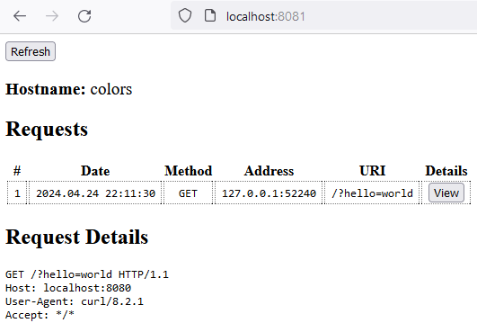

# WebEcho 
Simple web-server written in Go that will echo the request it recieves (both to a log and the http response)

It includes a web gui for viewing historic requests (via the admin port)

<!-- testing -->

## Examples
Starting it up
```
$ ./webecho.exe
2020/02/17 00:46:50 Using default web [5080] and admin [5081] ports, to use different ports run:

        webecho.exe <webPort> <adminPort>

2020/02/17 00:46:50 Admin Server listening on port 5081
2020/02/17 00:46:50 Web Server listening on port 5080
```

Making a simple request
```
$ curl -s localhost:5080?hello=world
GET /?hello=world HTTP/1.1
Host: localhost:5080
User-Agent: curl/7.65.3
Accept: */*
```

Also shown in the log
```
2020/02/17 00:48:33 WEB: [127.0.0.1:64939] /:

GET /?hello=world HTTP/1.1
Host: localhost:5080
User-Agent: curl/7.65.3
Accept: */*
```

As well is in the web-gui



## Building
To test locally execute:

```
go run .
```

To build with static content embedded use:
```
go get -u github.com/gobuffalo/packr/packr
packr build
```
